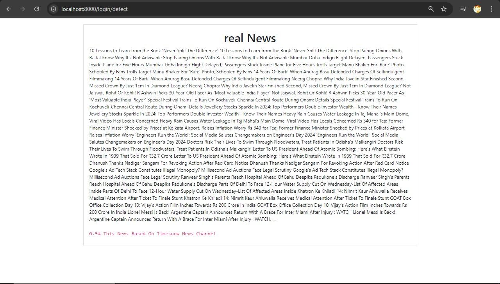
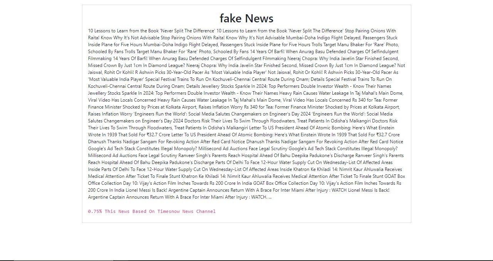
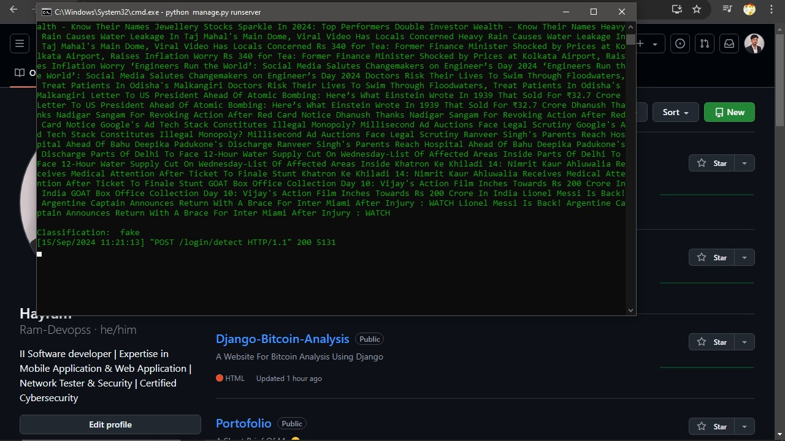

Real or Fake News Identification
================================

This project is a **Real/Fake News Identification** website built using **Django**. It aims to determine whether a given news article is real or fake by analyzing the text content. The dataset used for this analysis comes from **@TimesOfNews**, which provides a rich set of news articles labeled as either real or fake. The project uses machine learning techniques to classify the news, making it an essential tool for verifying the authenticity of online news.

Key Features:
-------------
• 📰 **News Classification** – Classify news articles as real or fake based on textual content.  
• 🏛️ **Dataset** – The news dataset is sourced from **@TimesOfNews**, ensuring high-quality data for the classification task.  
• 🧠 **Machine Learning** – A trained classification model is employed to analyze the news articles and predict their authenticity.  
• 📉 **Graphical Results** – The website generates visual outputs for real and fake news predictions, showing clear insights for users.  
• 🌍 **Responsive Design** – The website is optimized to work seamlessly across different devices, from desktops to mobile phones.

How It Works:
-------------
The system processes input text from a news article and analyzes it using a machine learning classification model. The model is trained on the **@TimesOfNews** dataset, which contains labeled examples of real and fake news. The Django web application takes user inputs, processes the data, and provides a prediction of whether the article is real or fake. The result is then visually presented to the user, showing either a "real news" or "fake news" graphical output.

Installation & Setup:
---------------------
To run the project locally, follow these steps:

1. **Clone the Repository**:  
   ```
   git clone https://github.com/yourusername/news-identification.git
   ```

2. **Navigate to the Project Directory**:  
   ```
   cd news-identification
   ```

3. **Set Up a Virtual Environment** (optional but recommended):  
   ```
   python -m venv venv  
   source venv/bin/activate   # On Windows: venv\Scripts\activate
   ```

4. **Install Required Dependencies**:  
   ```
   pip install -r requirements.txt
   ```

5. **Apply Database Migrations**:  
   ```
   python manage.py migrate
   ```

6. **Run the Development Server**:  
   ```
   python manage.py runserver
   ```

7. **Access the Website**:  
   Open your browser and visit `http://127.0.0.1:8000` to interact with the news classification system.

Screenshots:
------------
• 🟢 **Real News Output** – Example output for real news articles, displaying a graphical result of the prediction.  
   

• 🔴 **Fake News Output** – Example output for fake news articles, displaying a graphical result of the prediction.  
   

• 🤖 **Classification Model** – The machine learning classification model used to predict real or fake news.  
   

Contributor:
------------
This project was developed by **Ramdevops2005**. For more details or inquiries, please contact:  
✉️ **ramdevops2005@gmail.com**

License:
--------
This project is intended for educational and personal use. The classification model and dataset are used for research purposes to demonstrate news authenticity analysis.
```
